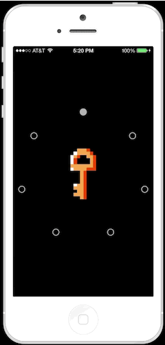

# YLTapPatternRecognizer

[UIGestureRecognizer](http://developer.apple.com/library/ios/#documentation/uikit/reference/UIGestureRecognizer_Class/Reference/Reference.html) subclass that matches taps to a particular pattern.
Use it to unlock easter eggs or beta features. But only for those who know the secret code.

## Installation

Simply add the files in the `TapPatternRecognizer` folder to your project or add `YLTapPatternRecognizer` to your Podfile.

## Configuration

The default pattern is [shave and a haircut](http://en.wikipedia.org/wiki/Shave_and_a_Haircut).

<audio controls> 
  <source src="http://upload.wikimedia.org/wikipedia/commons/7/7d/Shavehaircut.ogg" type="audio/ogg"/>
  <source src="https://github.com/ejensen/YLTapPatternRecognizer/blob/master/Demo/shavehaircut.mp3" type="audio/mpeg"/>
</audio>

You can use the predefined within `YLTapPatterns` or create your own custom pattern.

See the [header](TapPatternRecognizer/YLTapPatternRecognizer.h) for full documentation.

## Demo

Build and run the `SecretTapDemo` project in Xcode to see `YLTapPatternRecognizer` in action.

## Credits

Originally inspired by the [Secret Knock Detecting Door Lock](http://grathio.com/2009/11/secret_knock_detecting_door_lock/).

## License

YLTapPatternRecognizer is available under the MIT license. See the [LICENSE](LICENSE) file for more info.
